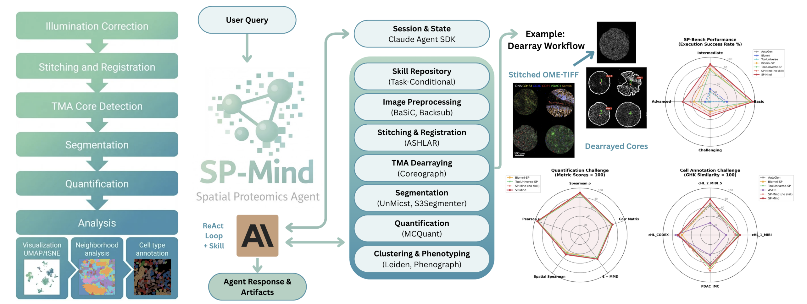

<h1 align="center">
🧬 SP-Mind: An Autonomous Reasoning Agent for Spatial Proteomics (ICML 2026)
</h1>

<p align="center">
<a href="https://arxiv.org/abs/2606.24235" target="_blank"></a>
<a href="https://github.com/tomtommyyuan/spmind"></a>
<a href="https://huggingface.co/datasets/tomyuanyucheng/spmind"></a>
</p>

<p align="center">
  <video src="https://github.com/tomtommyyuan/spmind/raw/main/assets/spmind_promo_55s_voiceover.mp4" controls muted width="100%"></video>
</p>
<p align="center">
  <em>▶ 55-second overview — if the player doesn't load, <a href="https://github.com/user-attachments/assets/bfb34300-3d4f-4960-9d26-89412a211c24">watch the demo video</a>.</em>
</p>

<p align="center">
  
</p>

## Abstract

Spatial proteomics enables single-cell-resolution characterization of protein expression within tissue architecture, playing a critical role in understanding tumor microenvironments and guiding precision medicine. However, current analysis workflows remain fragmented, requiring expert manual orchestration of heterogeneous tools and limiting research scalability and reproducibility. We present SP-Mind, the first autonomous AI agent designed to unify the spatial proteomics analysis pipeline, from raw multiplexed tissue imaging to downstream phenotype discovery. Equipped with expert-curated biological analysis skills and specialized computational tools, SP-Mind converts natural-language queries into end-to-end analytical workflows without task-specific fine-tuning. To rigorously evaluate its capabilities, we introduce SP-Bench, a comprehensive benchmark spanning diverse tissue types, comprising 102 tasks across 18 distinct categories. Through extensive evaluation on SP-Bench and established downstream tasks, SP-Mind achieves state-of-the-art performance compared to existing open-source biomedical agent baselines.

## Overview

SP-Mind is built on the **Claude Agent SDK** and ships with:

- A reasoning agent that selects tools, writes code, inspects intermediate
  results, and iterates in a data-driven loop.
- Wrappers around the standard multiplexed-imaging toolchain (MCMICRO-style),
  packaged as containerized tools.
- A curated set of domain **skills** that inject best-practice methodologies for
  each analysis stage.
- **SP-Bench**, a benchmark of realistic spatial proteomics task queries, plus
  evaluation scripts for cell annotation and quantification.

### Agent Design

- **MCP-native tools (opt-in).** With `--mcp`, the full toolchain is exposed to
  the agent as a [Model Context Protocol](https://modelcontextprotocol.io) server
  of typed, schema-validated tools (generated from the tool metadata in
  [`spmind/tool/tool_description/`](spmind/tool/tool_description/)), rather than as
  free-form code the model has to write. The same server can be installed into
  Claude Desktop / Claude Code (see [Use SP-Mind inside Claude](#use-sp-mind-inside-claude)).
  Off by default, so the base agent's behavior is unchanged.
- **Sandboxed execution.** An optional `--sandbox` flag installs `PreToolUse`
  guardrails that block destructive shell commands before they run — a safety
  layer for fully autonomous (`--dangerously-skip-permissions`) runs.

### Pipeline Capabilities

| Stage | Module | Backend |
|-------|--------|---------|
| Illumination correction | `spmind.tool.basic_illumination` | BaSiC |
| Registration / stitching | `spmind.tool.registration` | ASHLAR |
| Background subtraction | `spmind.tool.background_subtraction` | Backsub |
| TMA dearraying | `spmind.tool.unetcoreograph` | UNetCoreograph |
| Nuclei probability maps | `spmind.tool.segmentation_unmicst` | UnMICST |
| Cell segmentation | `spmind.tool.segmentation_s3segmenter` | S3Segmenter |
| Quantification | `spmind.tool.quantification` | MCQuant |
| Clustering & phenotyping | `spmind.tool.clustering` | Scimap |
| Cell-type annotation | skill-guided LLM reasoning | — |

<br>

## Installation

### Prerequisites

- Python ≥ 3.11
- [Claude Code CLI](https://docs.claude.com/en/docs/claude-code) — `npm install -g @anthropic-ai/claude-code`
- A container runtime for the imaging tools: **Docker** (local) or **Apptainer/Singularity** (HPC)

### Install the package

```bash
git clone https://github.com/tomtommyyuan/spmind.git
cd spmind
pip install -e .
```

### (Optional) Install scimap for host-side analysis

The clustering and phenotyping steps run `scimap` **inside the tool containers**, so
`scimap` is not required for the core pipeline and is intentionally left out of the
package dependencies. If you want `scimap` available in your local environment (e.g.
for interactive downstream analysis), install it separately. Its published metadata
pins several outdated versions, so install it without dependencies and then add the
runtime extras:

```bash
pip install scimap --no-deps
pip install combat fast_histogram smart_open requests "gensim>=4.3.2" \
    shapely plotly mpl-scatter-density PhenoGraph "dask[array]" tifffile
```

### Configure your API key

```bash
cp .env.example .env
# then edit .env and set ANTHROPIC_API_KEY=...
```

Or export it directly:

```bash
export ANTHROPIC_API_KEY="your-anthropic-api-key"
```

### Pull the tool containers

The analysis tools run inside containers. Pull them once with the helper scripts:

```bash
# Linux / Intel Mac
bash scripts/pull_docker_images.sh

# Apple Silicon (ARM64)
bash scripts/pull_docker_images_arm64.sh

# HPC with Apptainer / Singularity
bash scripts/pull_singularity_images.sh
```

<br>

## Quick Start

### 1. Interactive CLI

The fastest way to start. Launches an interactive session (like Claude Code):

```bash
spmind --dangerously-skip-permissions
```

Or run a single task non-interactively:

```bash
spmind -p "Perform cell probability mapping + segmentation on 1.ome.tif, save the result to ./output" --dangerously-skip-permissions
```

Useful flags: `--model claude-sonnet-4-5`, `--path ./data`, `-v` (verbose),
`--mcp` (expose the toolchain as native MCP tools), `--sandbox` (block
destructive shell commands), `--dangerously-skip-permissions` (fully autonomous).

### 2. Python API

```python
from spmind.agent import SPMindAgent

agent = SPMindAgent(path="./data", model="claude-sonnet-4-5")

result = agent.go(
    "Generate illumination correction profiles for the 10 raw cycles in "
    "./data/illumination_input and save the flat-field/dark-field profiles to ./data/illum"
)
print(result)

# Multi-turn: the session is maintained automatically
agent.go("Now stitch and register those cycles into a single mosaic.")

# Start a fresh conversation
agent.reset_session()
```

For streaming output, use `async for msg in agent.go_stream(prompt): ...`.

### 3. Script runner

`run_agent.py` runs a single prompt and logs the full trace with a timestamp:

```bash
python run_agent.py "Segment cells in 1.ome.tif and quantify marker intensities" \
    --output-dir ./agent_logs --dangerously-skip-permissions
```

### 4. Web interface

```bash
python gradio_app.py
```

### 5. Use SP-Mind inside Claude

Because the toolchain is exposed as an MCP server, you can call the SP-Mind tools
directly from your own **Claude Code** or **Claude Desktop** session. This is a
*local* integration — SP-Mind must be `pip install`-ed and its containers pulled
on your machine, and the tools run locally (nothing is uploaded).

**Option A — add the MCP server directly:**

```bash
# Claude Code
claude mcp add spmind -- python -m spmind.mcp_stdio
```

For **Claude Desktop**, add to `claude_desktop_config.json`:

```json
{
  "mcpServers": {
    "spmind": { "command": "python", "args": ["-m", "spmind.mcp_stdio"] }
  }
}
```

**Option B — install as a Claude Code plugin** (this repo doubles as a plugin
marketplace):

```bash
/plugin marketplace add tomtommyyuan/spmind
/plugin install spmind@spmind
```

Both options expose the same 19 typed tools.

<br>

## Benchmark & Experiments

- **`benchmark/`** — SP-Bench task queries (`sp_bench.jsonl`) spanning the full
  spatial proteomics pipeline across difficulty tiers, plus a generator script.
- **`experiments/`** — reproduction scripts for the three evaluation tracks in
  the paper (SP-Bench execution, cell annotation, cell quantification). See
  [`experiments/README.md`](experiments/README.md) for full instructions and
  dataset download links.

> [!NOTE]
> **Model version.** All experiments reported in the paper were run with
> **Claude Sonnet 4** (`claude-sonnet-4-20250514`). That model has since been
> retired, so for a smooth out-of-the-box experience the codebase now defaults to
> **Claude Sonnet 4.5** (`claude-sonnet-4-5`).

The SP-Bench and cell annotation datasets are hosted on
[Hugging Face](https://huggingface.co/datasets/tomyuanyucheng/spmind):

```bash
huggingface-cli download tomyuanyucheng/spmind --repo-type dataset --local-dir data
```

<br>

## Citation

If you find SP-Mind useful, please cite our paper:

```bibtex
@misc{yuan2026spmindautonomousreasoningagent,
      title={SP-Mind: An Autonomous Reasoning Agent for Spatial Proteomics Analysis},
      author={Yucheng Yuan and Yuanfeng Ji and Zhongxiao Li and Ruijiang Li},
      year={2026},
      eprint={2606.24235},
      archivePrefix={arXiv},
      primaryClass={cs.AI},
      url={https://arxiv.org/abs/2606.24235},
}
```

<br>

## License

SP-Mind is released under the terms of the [LICENSE](LICENSE) file in this
repository. Note that the integrated third-party tools and their container
images may carry their own licenses; review each before commercial use.
